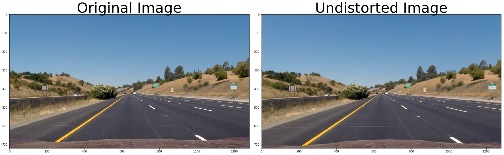
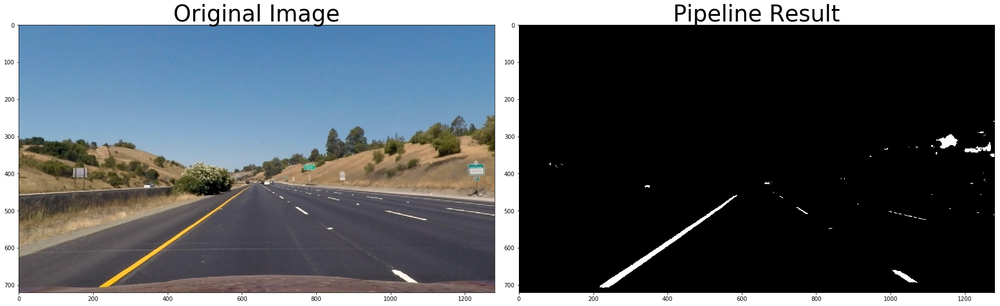

# Advanced Lane Finding Project


### Camera Calibration

The code for this step is contained in the first 4 code cells of the IPython notebook located in [project.ipynb]("./project.ipynb").

I start by preparing "object points", which will be the (x, y, z) coordinates of the chessboard corners in the world. Here I am assuming the chessboard is fixed on the (x, y) plane at z=0, such that the object points are the same for each calibration image.  Thus, `objp` is just a replicated array of coordinates, and `objpoints` will be appended with a copy of it every time I successfully detect all chessboard corners in a test image.  `imgpoints` will be appended with the (x, y) pixel position of each of the corners in the image plane with each successful chessboard detection.  

I then used the output `objpoints` and `imgpoints` to compute the camera calibration and distortion coefficients using the `cv2.calibrateCamera()` function.  I applied this distortion correction to the test image using the `cv2.undistort()` function and obtained this result: 

<p align="center">  </p>

### Pipeline (single images)

#### 1. Distortion-corrected road image.

To demonstrate this step, I will describe how I apply the distortion correction to one of the test images like this one:
<p align="center">  </p>

#### 2. Binary conversion.

I used a combination of HLS and Lab color thresholds to generate a binary image (using the function `binary_image()` in [project.ipynb]("./project.ipynb")).  Here's an example of my output for this step:

<p align="center">  </p>

#### 3. Perspective transformation.

The code for my perspective transform includes a function called `warp()`, (which appears in [project.ipynb]("./project.ipynb")).  The `warper()` function takes as inputs an image (`img`), and contains source (`src`) and destination (`dst`) points.  I chose the hardcode the source and destination points in the following manner:

```python
    src1 = np.float32([(575,464),
                      (707,464), 
                      (258,682), 
                      (1049,682)])
    dst = np.float32([(450,0),
                      (w-450,0),
                      (450,h),
                      (w-450,h)])
```


I verified that my perspective transform was working as expected by drawing the `src` and `dst` points onto a test image and its warped counterpart to verify that the lines appear parallel in the warped image.

<p align="center">  </p>

#### 4. Identification of ane-line pixels and polynomial fitting

I used the histogram and sliding windows method to identify left and right line pixel positions. Then I used numpy's polyfit() function to fit left and
right lane lines. In my project, I use the function `find_initial_lines()` to find lane lines from the first frame and the function `find_lines()` to find the lines from the subsequent frames in the video.

![alt text][image5]

#### 5. Curvature of the lane and the position of the vehicle with respect to center.
The function `calc_curv_rad_and_center_dist()` performs curvature and lane center calculation. In the function, I first converted x and y from pixels space to meters and then fit polynomials to x, y in world space. I used the formula provided below to calculate the radii of curvature. 
```python
left_curverad = ((1 + (2*left_fit_cr[0]*y_eval*ym_per_pix + left_fit_cr[1])**2)**1.5) / np.absolute(2*left_fit_cr[0])
right_curverad = ((1 + (2*right_fit_cr[0]*y_eval*ym_per_pix + right_fit_cr[1])**2)**1.5) / np.absolute(2*right_fit_cr[0])
```

#### 6. Drawing fitted lane lines on the road.

I implemented this step in the function `daw_lines()`.  Here is an example of my result on a test image:

<p align="center">  </p>

---

### Pipeline (video)

I use the function `process_image()` as the core function in my lane-line detection pipeline. For each video frame (i.e., image), `process_image()` calls the following function in the give order:
1. `cal_undistort()`
2. `binary_image()`
3. `warp()`
4. `find_initial_lines()` or `find_lines()`
5. `draw_lines()`

Here's a [link to my video result](./images_and_videos/project_video_output.mp4)

---

### Discussion

My current pipeline works fine for the video provided in this project. The current code may not work as well on challenging roads that are not very flat or have very sharp curves. In such cases, the histogram and sliding windows method may need to be used every now and then. Also, sanity checks to ensure the detected lines are always parallel and they have some sort of extension from the lines identified in previous frames. 
 